<h1 align="center">Hi there, I'm Mirza Sadique Baig 👋</h1>
<h3 align="center">DevOps Engineer | AWS • Kubernetes • Terraform • CI/CD</h3>

  

  
  
  

  
  

---

<!-- 🐍 Contribution snake — replace this whole 
 block after the Action generates the file, see setup steps -->

  

---

### 🧑‍💻 About Me

- 🔭 Entry-level **DevOps Engineer** with hands-on experience deploying and operating workloads on a 4-node Kubernetes cluster (34+ pods)
- ⚙️ Provision AWS infrastructure with **Terraform** — reusable modules, S3 remote state, DynamoDB/S3-native state locking
- 🚀 Build **CI/CD pipelines** with Jenkins, GitHub Actions, and GitOps delivery via **Argo CD**
- 🔐 Configure Kubernetes **RBAC** (ServiceAccounts, Roles, ClusterRoles, CSRs) and manage secrets with **HashiCorp Vault**
- 📊 Set up monitoring with **Prometheus & Grafana**
- 🌱 Focused on infrastructure automation, secure deployments, and reliability

---

### 🛠️ Tech Stack

**Cloud (AWS)**

**Containers & Orchestration**

**Infrastructure as Code**

**CI/CD & GitOps**

**Security & Secrets**

**Monitoring & Observability**

**Scripting & OS**

-FCC624?style=flat-square&logo=linux&logoColor=black)

---

### 🚀 Featured Projects

<table>
<tr>
<td width="50%" valign="top">

**🗨️ Kubernetes-Based Full-Stack Chat App**
Containerized a full-stack chat app with Docker; deployed frontend, backend, and MongoDB to Kubernetes via Minikube. Designed Deployments, Services, and namespaces; wired backend-to-MongoDB connectivity through service discovery.
`Docker` `Kubernetes` `Minikube` `MongoDB`

</td>
<td width="50%" valign="top">

**☁️ AWS Infrastructure Provisioning with Terraform**
Provisioned VPC, EC2, IAM, S3, Security Groups, Key Pairs, and EKS entirely through Terraform. Structured config as reusable modules; configured remote state in S3 with DynamoDB locking.
`Terraform` `AWS` `EKS`

</td>
</tr>
<tr>
<td width="50%" valign="top">

**🔐 Secrets Management with HashiCorp Vault on Kubernetes**
Deployed Vault to a Kubernetes cluster, enabled the KV secrets engine, and configured the Kubernetes auth method so pods authenticate with their ServiceAccount tokens. Injected secrets via the Vault Agent Injector, removing plaintext credentials from manifests.
`Vault` `Kubernetes` `Security`

</td>
<td width="50%" valign="top">

**🔄 CI/CD Automation & GitOps Delivery**
Built Jenkins pipelines covering source checkout, Docker build, registry push, and K8s deployment. Automated release workflows with GitHub Actions and implemented GitOps delivery with Argo CD.
`Jenkins` `GitHub Actions` `Argo CD`

</td>
</tr>
<tr>
<td width="50%" valign="top">

**📈 Kubernetes Monitoring & Observability Stack**
Deployed Prometheus and Grafana via Helm charts. Built dashboards tracking CPU/memory utilization across nodes and workloads to catch resource pressure and failing workloads early.
`Prometheus` `Grafana` `Helm`

</td>
<td width="50%" valign="top">

**🐧 Linux Administration & Bash Automation**
Wrote Bash scripts automating user management, backups, log rotation, and health checks on Ubuntu servers. Configured SSH key-based auth and cron scheduling for unattended jobs.
`Bash` `Linux` `Cron`

</td>
</tr>
</table>

> 📌 All projects live on my GitHub — check my pinned repos below for code and READMEs.

---

### 📊 GitHub Stats

  
  

  

  

> ℹ️ Stats & Top Languages cards auto-update daily via GitHub Actions (see `stats.yml`) — no external service dependency, so they won't randomly break.

---

### 🎓 Training & Education

**Complete DevOps, Docker & Kubernetes Bootcamp** — Practitioner-led weekend program conducted by working DevOps and SRE engineers, Pune
`Trained hands-on in Docker, Kubernetes, CI/CD, and cloud fundamentals`

**Master of Commerce (M.Com)** — Degloor College, affiliated with SRTMU, Nanded — CGPA: 7.99

---

### 🌱 Currently Focused On

- Deepening Kubernetes security practices (RBAC, network policies)
- Expanding Terraform module design for multi-environment setups
- Sharpening GitOps workflows with Argo CD
- Building a personal portfolio site to complement this profile

---

### 📫 Let's Connect

  
  

<i>Open to DevOps Engineer / Intern opportunities 🚀</i>

